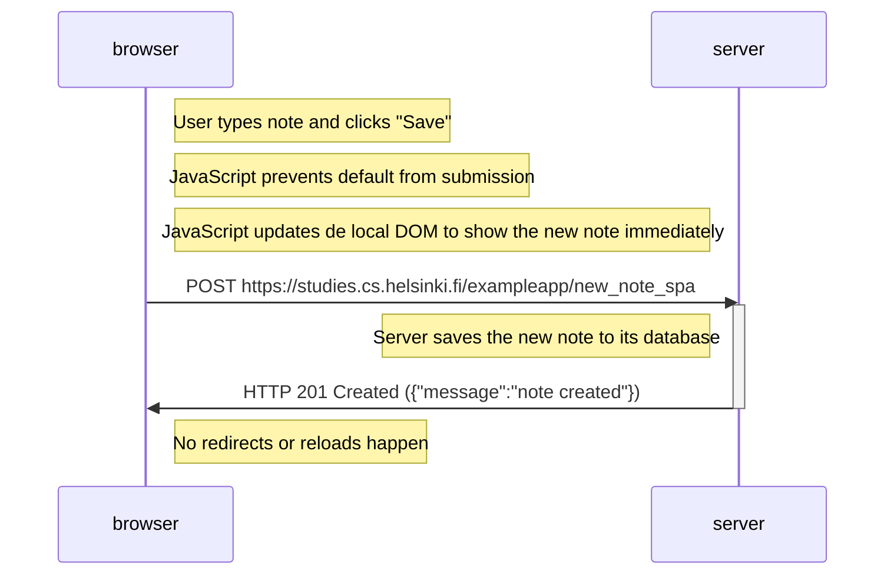

```mermaid
sequenceDiagram
    participant browser
    participant server

    Note right of browser: User types note and clicks "Save"
    Note right of browser: JavaScript prevents default from submission
    Note right of browser: JavaScript updates de local DOM to show the new note immediately

    browser->>server: POST https://studies.cs.helsinki.fi/exampleapp/new_note_spa
    activate server
    Note left of server: Server saves the new note to its database
    server->>browser: HTTP 201 Created ({"message":"note created"})
    deactivate server

    Note right of browser: No redirects or reloads happen
```